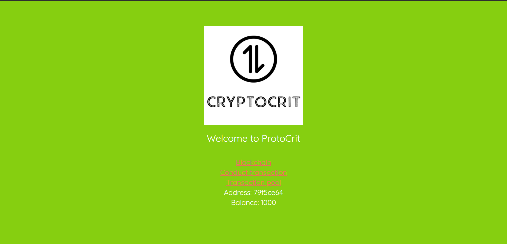
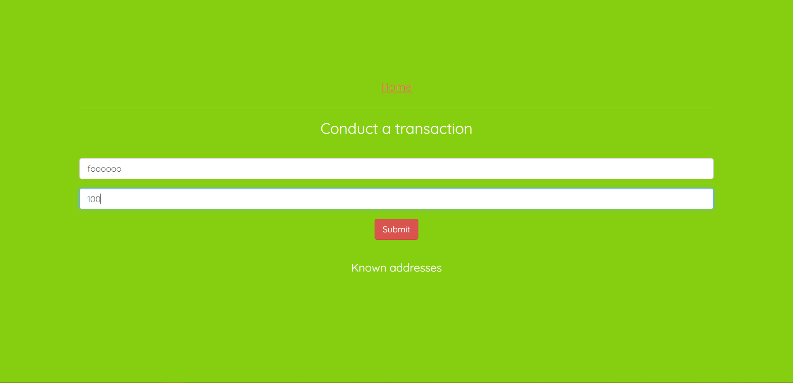
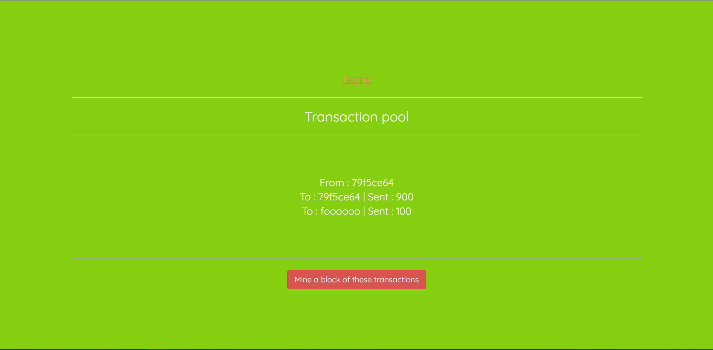
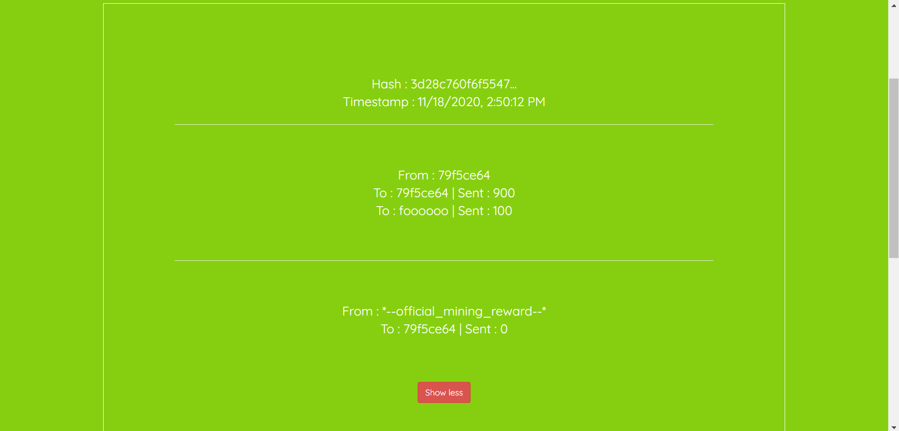

# CRYPTOCURRENCY PROTOTYPE.

## CERTAIN REQUIREMENTS.


**Activate the virtual environment**
<br>
Make sure you create a virtual python environment using the command given as follows
```
python3 -m venv blockchain-env
```
This is a requirement because any change in the python module in the system can affect the whole code. A virtual environment will not cause any such problem to the system modules.

```
source blockchain-env/bin/activate
```
For windows, make sure to create a seperate virtual enviroment named 'blockchain-env'
To run the code for blockchain environment
```
./blockchain-env/Scripts/activate
```

**Installing all the requirements**
<br>
All the requirements will be updated in the requirements.txt file hence there will not be any requirement of typing numbers of code. Enter the following code in the terminal or command prompt to install the given requirements. Make sure you have pip installed.
```
pip3 install -r requirements.txt
```
For windows , make sure you have Microsoft Visual C++ installed in your computer  (14.0 or higher). Otherwise some modules may not get installed which will cause the application to crash. If you are not able to run the requirements, please type the required module without the version number. This will give you the program with latest version.

For windows installation
```
pip install -r requirements.txt
```

**Running tests**
<br>
Make sure to activate the virtual environment first. Then later perform these tests.
```
python3 -m pytest backend/tests
```
For windows 
```
python -m pytest backend/tests
```

**Running the app and API**
<br>
Make sure to activate the virtual environment first. Then perform these tests.
```
python3 -m backend.app
```
For windows
```
python -m backend.app
```

**Running a peer instance**
<br>
Make sure to activate the virtual environment.
```
export PEER=True && python3 -m backend.app
```

**Run the frontend**
<br>
Make sure to navigate to frontend directory of python-blockchain
Make sure to have react installed or at lease react-scripts.
```
npm run start 
```

**Seed the backend with data**
Make sure to activate the virtual environment for python
```
export SEED_DATA=True && python3 -m backend.app
```
Unfortunately I couldn't find any matching shell command for Windows to run Seed data.

___
## DEVELOPER'S IDEA
My idea is to create a cryptocurrency system which I can utilise for payments inside the college. The idea is to create a full fledged cryptocurrency system with certain nodes and verification. I hope to make teacher's desktops as miners and students as the wallet holders. Teacher's desktop will verify and add the transaction details to the blockchain and on spending some computational power the teacher may recieve some incentive which will be decided during a later period. The value of the currency system will also be decided later on.
___
## DEVELOPER'S NOTES 

The notes provided are in chronological order. Even the words written are in chronological order.
<br>

- **Day 1(10/10/2020)**: Created the blockchain module and block module, also we have created the hashing function in the python-blockchain folder. The files are commented for anyone to understand the code.[END OF DAY 1]

- **Day 2(11/10/2020)**: We have updated our modules into packages, and we have put __init__.py function each of the folders. We have split the modules into two categories blockchain and util. Blockchain contains the block and blockchain module. Util contains the other utilities required in the function. We have also set up a virtual environment using the venv command and to activate the virtual environment we have used the shell/terminal command mentioned above in this file.
So to activate the package format we use
```
python3 -m backend.blockchain.block
```
>We don't need any .py extension to the file as it automatically loads all the folders and stuff.

- I have also created some tests using Pytest. Pytest checks all the test cases at once rather than us have to type test cases inside the python file and then later we have to check cases for each of the files. Later I have also included time.asctime() to display the timestamp in form of string.[END OF DAY 2]

- **Day 3(18/10/2020)**: I have created the proof of work system in the Block.py module in the mine_block() method. I also have included certain tests in the test folder. Now I also have created a config.py file which will give the mention of the MINE_RATE. Now I have set the mine rate to 10 seconds. So we have to get the rate to around 10 seconds (4 seconds just for program purposes). Now we have added certain tests which support the proof of work system. Till now there was a hex based proof of work system but we need a binary form of proof of work system.
Now we have implemented a system for conversion of hex to binary and hence the difficulty determination is binary based work now. There is no new shell script other than testing the application.
Extra information is given in the required files.

- PART 2: Now I have implemented conditions required for validation of the block and test condtions in the test_block.py file. These tests will check the conditions necessary to validate a block. Also with the help of the pytest's 'with' keyword, we have been able to validate the require exception without the program crashing. Later we have provided test cases to validate a chain, which is basically validating multiple blocks. One important condition is that we have to validate the genesis block which we didn't do in block validation. Hence this was the extra thing we did in the blockchain validation. More stuff is given in programs as documentation string and as well as in commented blocks. Later we have included some chain texts which will help us setup nodes in the blockchain network. Later I will try to explain the use of REST api's and pubsub layers the best I can because I'm using it for the first time myself.[END OF DAY 3]

- **Day 4(25/10/2020)**: I have now setup Flask which is a python module used to create web applications as well as API. The installation of this module is updated in the requirements.txt file. This will install the required modules in the virtual environment. Then later I have been able to run the application which have helped to run this application as localhost. I have also imported the jsonify class to convert objects into JSON format which can be utilised by any application to read data. But then Blockchain class is not JSON serializable hence we need to provide a method in the blockchain class which does so. I have added a method which will return the string to it's JSON format which is either a dictionary, string, tuple, response instance or a valid callable. This ensures that the text in the blockchain gets jsonified and we will get the proper blockchain output in the JSON format which can be utilised by the application to access it's data. Later I also have setup the mine block route in the app directory's __init__.py file which does the mining method in the server. Later in the day I have installed requests module in python which will help get any peer node the already present blockchain data. This will ensure all the nodes remain upto date in the network.

- **Day 5(14/11/2020)**: Today I began my work with developing a cryptocurrency system in this project. I have started by making a folder for the wallet which has different parameters. A wallet should contain a public key, a private key, transactions and wallet balance. So by python I have created a wallet module (by adding an init file along with the main file.), this features wallet data mentioned above, method for signing transactions as well as verify them. Initially I have imported a UUID module which serves us as a Unique digital identifier, this will help us prevent repeating transactions over the same address. Our method for cryptography is EC(Elliptic cryptography), but soon our team will try to migrate to RSA cryptography. This method is highly complex mathematics and will not be easy to crack the original data once created. I have also updated the requirements.txt file in this folder so that future developers can collaborate into this project by downloading the required files. There are many inbuilt functions in the modules. I have also included a test to verify the wallet data in the tests folder in the backend module. 

- Later I have also created a transaction module which facilates the transactions in this cryptocurrency network. This includes the wallet module created and uuid module which provides a unique identifier to the new module. The transactions module contains input structure and output structure which will record and calculate the balance necessities in a wallet. This includes exceeding balance which should result in a failure of transactions. We have also included tests for the transactions which will help us in correcting any error which comes into the code without having to run any programs again and again.

- **Day 6 (15/11/2020)**: Today I have installed another application which will bring us POST requests necessary for carrying out transactions, for that we have refactored some code which has helped in running the application smoothly (serialised public key and signature), I have imported a few encoding and decoding functions which will help convert byte strings to required format (either lists, tuples, dictionaries, strings, or booleans). We have also been able to get the signature values in the form of a tuple using elliptic key Cryptography decoding and encoding functions. The application we are using is POSTMAN (i guess which will not be required in later stages).

- Next I have created a transaction pool which will store the transaction data which will be available for the node to read. Later I am also trying to broadcast transactions by deserialising them back to it's instance which will help read the transaction data and it's output. Later this design will also help in implementation of the frontend mechanics.

- **Day 7(16/11/2020)**: Today our goal was to complete the backend part of our project. This involved linking our cryptocurrency system to our blockchain system. We already have built our blockchain module in it's entirity by taking the data as some test string. This test string is now replaced with the actual transaction data which we require during any transaction activity. We have jsonified this data hence this can be readable accross any websites. We have also performed some test app scripts which will send data in realtime to check whether the application works properly or not. During this process we also encountered that there are multiple outputs adding into the same recepient, we dealt with this by deleting the output from the list which has the same address. I guess we cannot send the same amount transactions to the same recipient, but I am sure we will be able to tackle that as well. 
 
- Later part of the day we have implemented mining rewards feature which I have basically set the reward to zero for cryptocurrency mining method. This reward will be given to the miner on successful mining of the block in the chain. Mining rewards is essential so that the miner is motivated to spend computational power to mine blocks. Though this project will not require much computational power since I have adjusted the mining rate to 4 seconds, hence the average rate of the mining will take about 4 seconds. This will ensure not much computational power is utilised to mine the block. Later we have written tests in the blockchain file which has covered some vulnerablities in the transaction part. This also makes the system secure and easy to operate into. This marked the end of Backend part, we will access the backend for certain functionalities.

- **Day 8(17/11/2020)**: Today we have marked our journey in frontend development. I have installed React using npx command which is installed when you install node.js file in your computer. React is mainly used for UI development, but overall react is used to reduce the usage of HTML, CSS and makes coding by JavaScript. React engine helps create DOMs for HTML which is dynamic and can be updated easily. We will be going ahead with the frontend part of the Blockchain.

- So today I have completed the frontend part of blockchain to display the blockchain data in the website. This included use of buttons installation of react-bootstrap and more. We have also learnt that we need to allow CORS to access the backend part of the chain. These things will be included in the requirements.txt file. I have also included pagination in this data field which will help in readablity of each chain data in the blockchain field. This marks the end of frontend for Blockchain, next I will try to get the frontend of cryptocurrency done in this section.

- **Day 9(18/11/2020)**: Today I have completed the frontend part of cryptocurrency system hence marking an overall conclusion to this project. Here we had made use of react-hooks of useState and useEffect for fetching data from our backend built in this project. I have also included certain links to make this project a multi page one. This includes the blockchain part of the project, transaction pool, mining button which will mine the transactions. Now we have also terminated the use of Postman as we have made a frontend which will link the transactions in the transaction entry method which will convert itself into a JSON method which will also gets updated. I have also included a function which allows us to update our transactions in 10 seconds. This marks the end of our course project.

- **CONCLUSION** : This project has been fun to work on. Although there are certain functions we need to work on, since this is a prototype.
    - An account based system, where an account can be created on giving credentials.
    - A non miner application where non miners can also transact between peers.
    - A system where the blockchain can catch up.
    - This system is similar to a centralised blockchain. There is only a root node (one with the localhost address 5000). Control needs to be shifted to another node when this node is taken down so that there will be no loss of data.
    - More information regarding API endpoints etc.
    - And last, a better functional UI.

- I have tried to cover my best to get this project functional and running. On the later part I have to set up a system which can run the scripts automatically on opening the application. This is just some part of the process which has been completed

- Thanks to anyone who has kept track till here. MAYBE I'll work more on it and hoping I will be able to completely make this application a full fledged cryptocurrency system.

- **RESULT** :





___
## ACKNOWLEDGEMENTS

This project wouldn't have been possible without the help of certain people who although unknowingly helped me to understand concepts of Blockchain and Cryptocurrency systems. The course link which I took is given below.

[Udemy course on Cryptocurrency systems](https://www.udemy.com/share/102sB6AEAec15UQ3wJ/)
